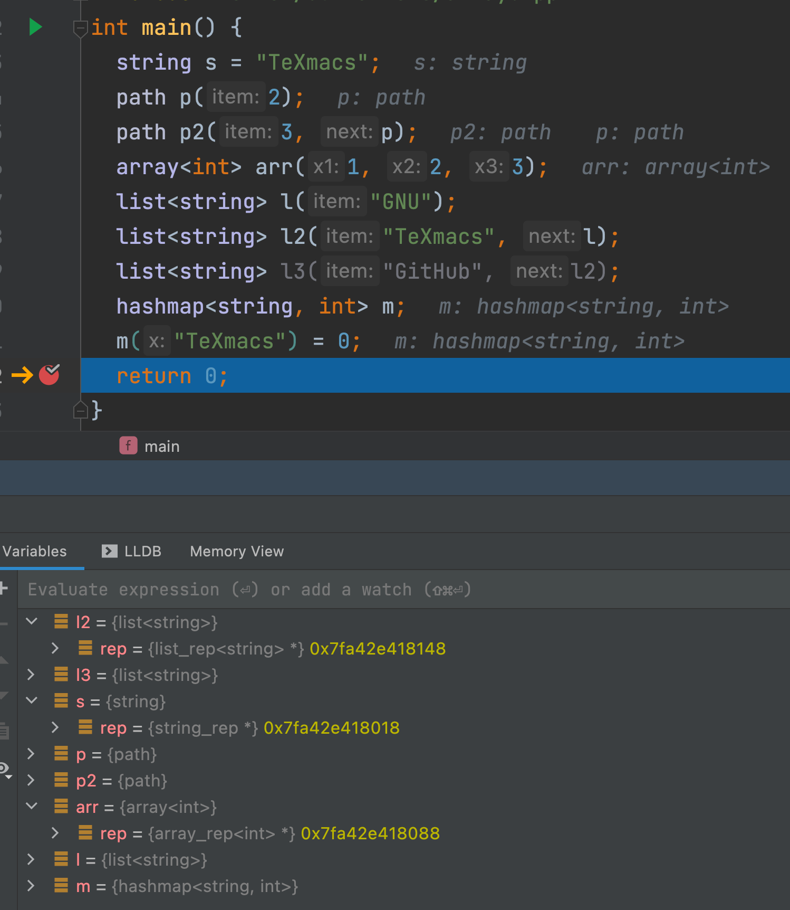
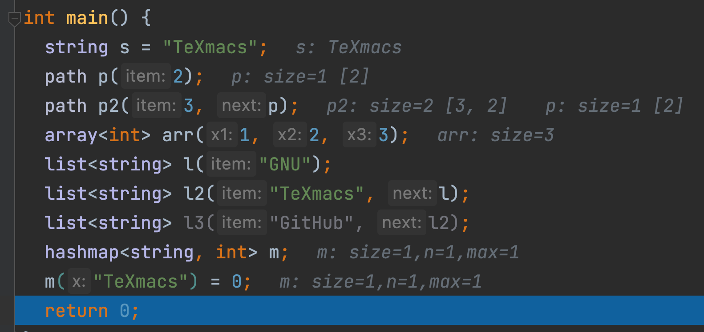
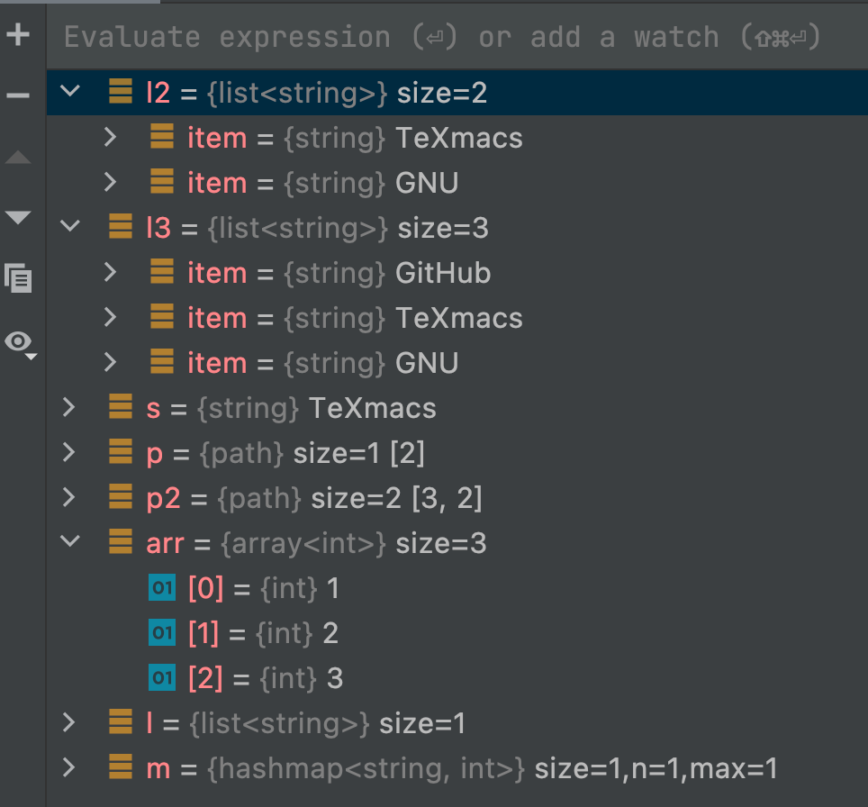

# LLDB-TeXmacs-Pretty-Printer
LLDB TeXmacs Pretty Printer for GNU [texmacs](https://github.com/texmacs/texmacs).

## Example

Before



After






## Installation

clone repo to `path/to/your`

```
git clone https://github.com/PikachuHy/LLDB-TeXmacs-Pretty-Printer.git
```


add command to `~/.lldbinit`

```
command script import "path/to/your/LLDB-TeXmacs-Pretty-Printer/texmacs.py"
```

## Hacking

See lldb [Variable Formatting](https://lldb.llvm.org/use/variable.html).

## Acknowledgement

The development of this LLDB TeXmacs Pretty Printer has referred to [LLDB-Eigen-Pretty-Printer](https://github.com/fantaosha/LLDB-Eigen-Pretty-Printer) and lldb examples of [summaries](https://github.com/llvm/llvm-project/tree/main/lldb/examples/summaries) and [synthetic](https://github.com/llvm/llvm-project/tree/main/lldb/examples/synthetic).

## License

Copyright © 2022 PikachuHy

Distributed under the GNU GENERAL PUBLIC LICENSE.